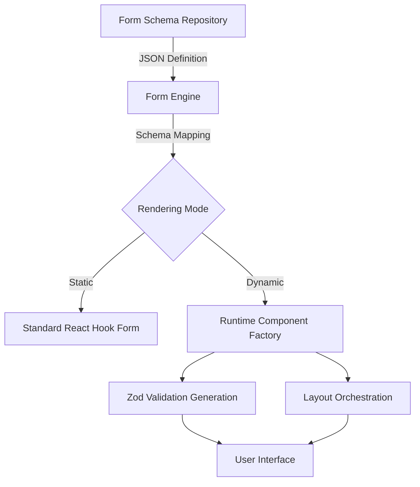

# Form Architecture & Data Entry Governance

| Metadata | Details |
| :--- | :--- |
| **Document ID** | ATLS-FRONT-05 |
| **Status** | AUTHORITATIVE |
| **Version** | 2.0.0 |
| **Owner** | Frontend Architecture Team |
| **Applicability** | All ATLS Frontend Applications (Web, Mobile, PWA) |

## 1. Form Philosophy
ATLS forms are not mere data entry points; they are **Operational Instruments**. In an agricultural environment, data entry often happens in high-stress, low-connectivity, and physically demanding conditions. 
- **Efficiency over Aesthetics**: Prioritize speed of entry and legibility.
- **Resilience by Design**: Assume the network will fail during submission.
- **Validation as Guidance**: Errors should help the user succeed, not punish them.
- **Context Awareness**: Pre-fill data wherever possible (GPS, current user, active shift).

## 2. Operational Form UX Principles
- **One Hand Operation**: Design for thumb-reach on mobile devices.
- **High Contrast**: Ensure legibility under direct sunlight.
- **Direct Action**: Minimize taps to reach the primary action.
- **Clear Hierarchy**: Use grouping to prevent cognitive overload.

## 3. Mobile-First Form Rules
- **Stack Everything**: Vertical layouts are mandatory for mobile. Multi-column grids are reserved for large screens only.
- **Touch Targets**: Minimum 44x44px for all interactive elements.
- **Keyboard Optimization**: Trigger correct OS keyboards (numeric, email, tel).
- **Sticky Actions**: The "Submit" or "Save Draft" buttons must be easily accessible (fixed footer on mobile).

## 4. Dynamic Form Architecture
ATLS utilizes a metadata-driven rendering engine to support rapidly changing agricultural requirements.

## 5. Schema-Driven Form Strategy
All forms must be defined by a JSON-compatible schema that describes:
- **Field Meta**: ID, Label, Placeholder, Tooltip.
- **Validation Meta**: Required, Min/Max, Regex, Custom Logic.
- **Visibility Meta**: Conditional logic strings (e.g., `show if category === 'CHEMICAL'`).
- **Data Mapping**: JSON paths for state management.

## 6. React Hook Form Governance
- **Uncontrolled Components**: Use `register` for standard inputs to minimize re-renders.
- **Controller Pattern**: Use `Controller` for complex components (Select, DatePicker, Media Upload).
- **Mode**: `onTouched` for validation to reduce noise while typing.
- **Default Values**: Mandatory for all fields to ensure stable initial state.

## 7. Zod Validation Strategy
Validation logic must be centralized in Zod schemas.
- **Shared Schemas**: Reuse schemas between Frontend and Backend (via monorepo or generated types).
- **Refinement Logic**: Use `.refine()` for cross-field validation (e.g., `end_date` > `start_date`).
- **Translation Keys**: Zod errors should return i18n keys, not hardcoded strings.

## 8. Client vs Server Validation Rules
- **Client**: Instant feedback for format, presence, and simple logic.
- **Server**: Authoritative validation for business rules (e.g., "Is this batch already closed?").
- **Sync**: Client-side validation must be a strict subset of server-side validation.

## 9. Form State Ownership
- **Local State**: `react-hook-form` owns the internal form state.
- **Global State**: Global stores (Zustand) should only be updated on successful submission or explicit "Save Draft" action.
- **Syncing**: Avoid "double binding" form state to global stores in real-time.

## 10. Draft Persistence Rules
Drafts must survive app restarts, browser refreshes, and device crashes.
- **Auto-Save**: Trigger `localStorage` or `IndexedDB` persistence every 30 seconds of inactivity or on field blur.
- **Storage Key**: `draft:[form_id]:[user_id]:[entity_id]`.
- **Cleanup**: Delete drafts only upon successful server confirmation.

## 11. Offline Form Persistence
ATLS forms must function 100% offline.
- **Queueing**: Submissions are pushed to the `OfflineQueue`.
- **Media**: Attachments are stored as Blobs in IndexedDB until sync.
- **Conflict Resolution**: The last-write-wins strategy applies to drafts, but server-side versioning (Optimistic Locking) applies to final submissions.

## 12. Multi-Step Form Architecture
Large operational tasks (e.g., Multi-Point Quality Inspection) must be broken down.
- **Progress Indicator**: Visible step list or progress bar.
- **Inter-Step Validation**: Users cannot advance to Step N+1 without valid Step N data.
- **Step Memory**: Current step index must be persisted in the draft.

## 13. Conditional Field Rendering
- **Declarative Logic**: Use the schema-driven engine to evaluate `watch()` values.
- **Clean Unmount**: When a field is hidden, its value must be unregistered or set to `null` to prevent "ghost data" in submissions.

## 14. Dynamic Section Rendering
- **Repeatable Groups**: Use `useFieldArray` for lists (e.g., adding multiple harvest loads to a single report).
- **Add/Remove UX**: Clear buttons with confirmation for deletions if the array item contains data.

## 15. Form Layout Standards
- **Label Placement**: Top-aligned labels for better vertical scanning.
- **Spacing**: 1.5rem (24px) between field groups; 1rem (16px) between individual fields.
- **Max Width**: On desktop, forms should not exceed `800px` to maintain readability.

## 16. Input Component Standards
- **Focus States**: High visibility outlines (min 2px).
- **Read-Only State**: Distinct from disabled; looks like plain text but selectable.
- **Standardized Widths**: Use `full` width for all inputs on mobile.

## 17. Numeric Input Rules
- **Input Mode**: `inputmode="decimal"` or `inputmode="numeric"`.
- **Unit Visibility**: Units (kg, L, ha) must be visible within the input suffix.
- **Step Control**: Provide large +/- buttons for field-worker efficiency where precision allows.

## 18. Date & Time Input Rules
- **Native Pickers**: Prefer native OS pickers on mobile for better touch performance.
- **Time Zones**: All timestamps must be captured in UTC and displayed in local farm time.
- **Quick Selects**: "Today", "Yesterday", "Shift Start" shortcuts.

## 19. Media Upload Field Rules
- **Image Compression**: Client-side compression before storage (Target < 500KB per image).
- **Evidence Capture**: Support "Camera Only" mode for field evidence to prevent file uploads of old photos.
- **Metadata**: Attach GPS coordinates and timestamp to the media record.

## 20. Voice Note Input Rules
- **Recording UX**: One-tap recording with visual waveform.
- **Format**: Opus/Ogg for high compression.
- **Transcript**: Show AI-generated preview (if online) for user verification.

## 21. GPS/Location Input Rules
- **Precision**: Minimum 10m accuracy required for operational logs.
- **Fallback**: Allow manual map pin drop if GPS signal is weak.
- **Background Capture**: Capture location at the moment the "Submit" button is pressed.

## 22. Searchable Select Rules
- **Minimum Threshold**: Enable search if the list exceeds 7 items.
- **Highlighting**: Highlight matching text in the results.
- **Empty States**: Offer "Add New [Entity]" if allowed by permissions.

## 23. Async Select Rules
- **Debouncing**: 300ms delay for remote searches.
- **Loading State**: Shimmer or spinner inside the select box.
- **Caching**: Cache remote results for 5 minutes within the session.

## 24. Large Dataset Selection UX
- **Virtualized Lists**: Use `react-window` for dropdowns with >100 items (e.g., Personnel list).
- **Categorization**: Group items (e.g., "Favorite Blocks", "All Blocks").

## 25. Validation UX Standards
- **Timing**: Validate on `blur` or `submit`. Never while the user is first typing in an empty field.
- **Visuals**: Red border (#ef4444) and helper text.
- **Scroll to Error**: Automatically scroll the first invalid field into view on failed submission.

## 26. Error Rendering Rules
- **Summary Box**: Show a summary of errors at the top of long forms.
- **Contextual**: Keep error messages close to the input.
- **Actionable**: "Email is required" is better than "Invalid input".

## 27. Success Feedback UX
- **Positive Reinforcement**: Confetti or checkmark animations for high-value submissions (e.g., Harvest completion).
- **Next Action**: Always provide "Go to Journal" or "Add Another" buttons.

## 28. Submission UX
- **Pending State**: Disable the submit button and show a loading spinner.
- **Double-Tap Prevention**: Implement a 2-second debounce on the submit handler.

## 29. Optimistic Submission Rules
- **UI Update**: Update the Operational Journal immediately with a "Pending" status.
- **Rollback**: If the server rejects the request, move the item back to "Drafts" and notify the user.

## 30. Retry & Recovery Strategy
- **Exponential Backoff**: Automatic retry for 5XX errors.
- **Manual Retry**: User-triggered sync button in the `OfflineQueue` for 4XX validation errors that need fixing.

## 31. Offline Queue Integration
All form submissions must pass through the `OfflineService`. 
- **Persistence**: Save submission payload to IndexedDB.
- **Sync Logic**: Process queue when `navigator.onLine` and `service.ping()` are successful.

## 32. Accessibility Rules
- **Aria Labels**: Every input must have an associated `<label>` or `aria-label`.
- **Keyboard Nav**: Focus traps for modals/multi-step flows.
- **Error Announcement**: Use `aria-live="polite"` for error messages.

## 33. RTL Form Rendering Rules
- **Mirroring**: Labels, icons, and input text alignment must mirror for Arabic/Hebrew.
- **Icons**: Directional icons (e.g., arrows) must be flipped. Functional icons (e.g., checkmarks) stay the same.
- **Flex/Grid**: Use logical properties (`margin-inline-start`) instead of `margin-left`.

## 34. Mobile Keyboard UX Rules
- **Return Key**: Set to "Next" for all fields except the last one ("Done/Go").
- **Auto-Capitalization**: Disable for technical IDs, emails, and barcodes.
- **Focus Padding**: Ensure focused input is not covered by the virtual keyboard (use `scrollIntoView` with offset).

## 35. Form Performance Constraints
- **Lighthouse Score**: Form pages must maintain >90 for Performance and Accessibility.
- **Input Lag**: Total Blocking Time (TBT) < 100ms during typing.
- **Memoization**: Use `React.memo` for static field groups in dynamic forms.

## 36. AI Safety Rules
- **Validation**: AI agents MUST NOT bypass Zod schemas.
- **Grouping**: FORBID giant forms (>10 fields) without logical `<fieldset>` grouping.
- **Consistency**: FORBID duplicated validation logic between client and server.
- **Feedback**: FORBID inline validation chaos (showing errors before user interaction).
- **State**: FORBID uncontrolled form state for critical operational data.
- **Submission**: FORBID blocking the main thread during submission.
- **Responsiveness**: FORBID non-responsive form layouts.
- **Workflows**: FORBID modal-only form workflows for complex data entry.
- **Selects**: FORBID massive select dropdowns (>10 items) without search functionality.
- **API**: FORBID direct API calls inside form inputs; use a controller/service layer.

## 37. Forbidden Form Anti-Patterns
- **Reset on Error**: Never clear user input when a server error occurs.
- **Hidden Requirements**: Do not hide "Required" markers (*).
- **Vanishing Labels**: Avoid "Floating Labels" that disappear or shrink too small for older eyes.
- **Fixed Widths**: Never use `px` for input widths; use `%` or `rem`.

## 38. Real Agricultural Form Scenarios
- **Pesticide Log**: Requires GPS lock, chemical select with automatic dosage calculation based on block area.
- **Harvest Report**: Multi-step flow: Load ID -> Vehicle -> Yield Weight -> Quality Grade -> Evidence Photos.
- **Attendance**: Searchable select of 500+ workers with "Offline-First" status tracking.

## 39. Future Dynamic Form Expansion
- **Plugin System**: Allow custom React components to be registered in the `FormEngine` via a lookup table.
- **Versioned Schemas**: Support schema migrations when the data structure changes but old drafts still exist.

## 40. Final Form Enforcement Checklist
- [ ] Schema is defined in Zod.
- [ ] Mobile-first layout verified (thumb-reach).
- [ ] RTL mirroring tested.
- [ ] Offline draft persistence verified (survives reload).
- [ ] Keyboard types set correctly.
- [ ] Success/Error UX states implemented.
- [ ] Accessibility (Aria/Labels) passing audit.
- [ ] Submission uses `OfflineQueue`.
